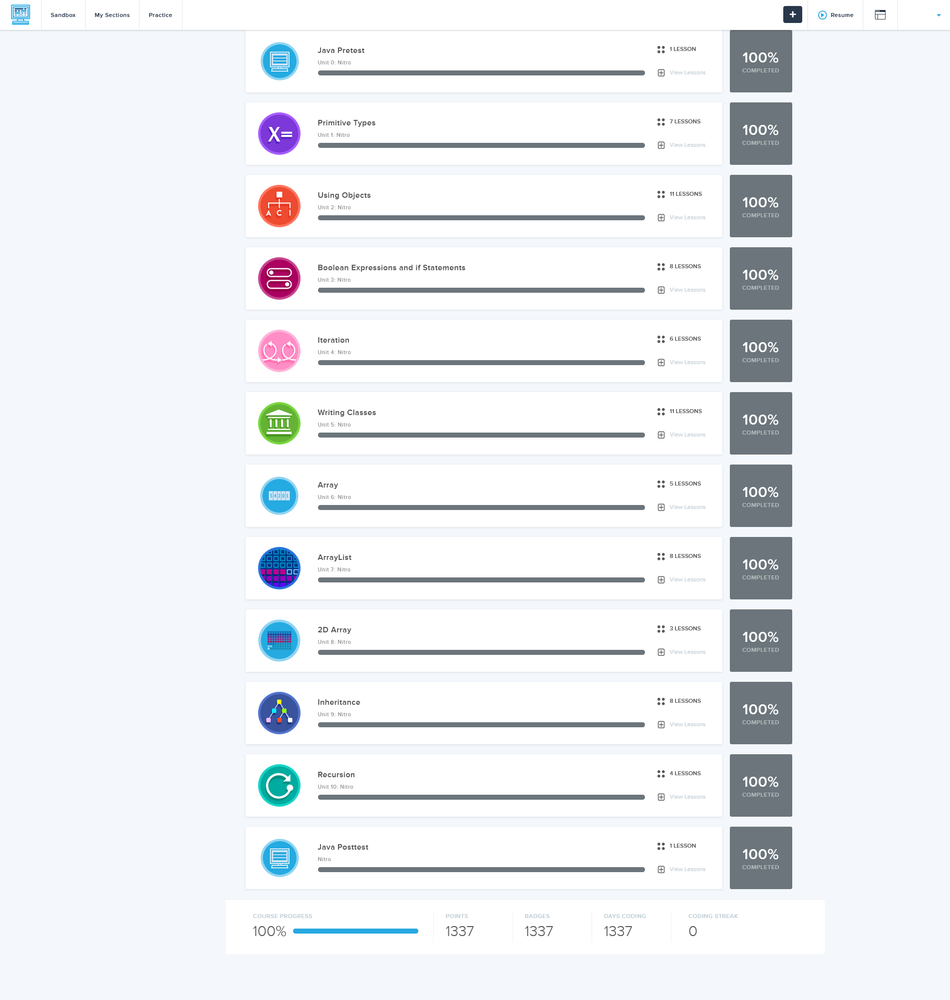

# CSA-Savior - [NEW WEBSITE](https://washiil.github.io/CSA-Savior/)
Collection of [CodeHS](https://codehs.com) / CSA answers and guides

~~This repository is now archived as of 01-07-2023. If this repository helps you out please leave a star.~~

> All code in repository passes required test cases before being uploaded. Try to understand the answers rather than just copy and I'm happy to explain anything!

 ~ Washi._

# Navigation

| Units |
| --- |
| [Unit 1 Primitive Types](https://github.com/Washiil/CSA-Savior/tree/main/Unit%201%20Primitive%20Types) |
| [Unit 2 Using Objects](https://github.com/Washiil/CSA-Savior/tree/main/Unit%202%20Using%20Objects) |
| [Unit 3 Boolean Expressions and If Statements](https://github.com/Washiil/CSA-Savior/tree/main/Unit%203%20Boolean%20Expressions%20and%20If%20Statements) |
| [Unit 4 Iteration](https://github.com/Washiil/CSA-Savior/tree/main/Unit%204%20Iteration) |
| [Unit 5 Writing Classes](https://github.com/Washiil/CSA-Savior/tree/main/Unit%205%20Writing%20Classes) |
| [Unit 6 Array](https://github.com/Washiil/CSA-Savior/tree/main/Unit%206%20Arrays) |
| [Unit 7 ArrayList](https://github.com/Washiil/CSA-Savior/tree/main/Unit%207%20ArrayList) |
| [Unit 8 2D Array](https://github.com/Washiil/CSA-Savior/tree/main/Unit%208%202D%20Array) |
| [Unit 9 Inheritance](https://github.com/Washiil/CSA-Savior/tree/main/Unit%209%20Inheritance) |
| [Unit 10 Recursion](https://github.com/Washiil/CSA-Savior/tree/main/Unit%2010%20Recursion) |

  
## Thank you and good luck future students!

