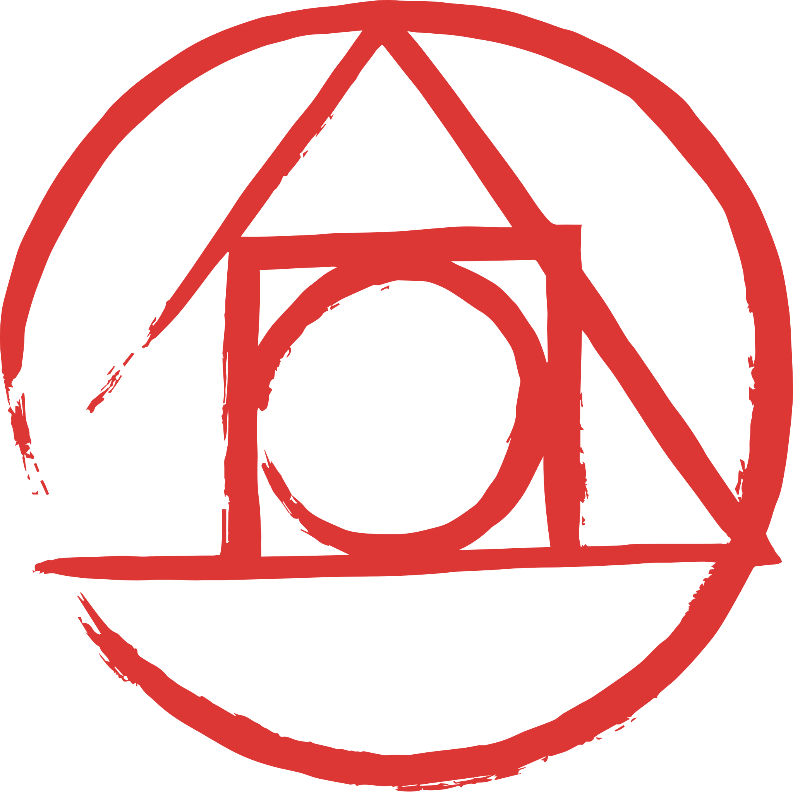
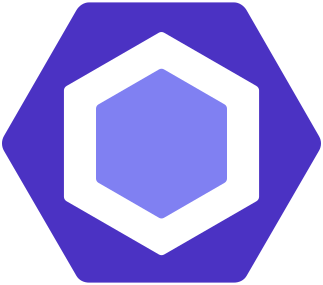

# CSA-Savior Website

Was planning to work on this project for quite a while and finally got around to flushing something out that makes sense. Website is entirely made with the `sveltekit` and `svelte`. Additionally I used the svelte port of `shadcn/ui` for many of my components.

## The Stack
<div align="center">
    
    
    
    
    
    
    
    
</div>

## Deployment
I used the beta of [Github Actions](https://docs.github.com/en/actions) to deploy my site automatically to github pages and generate the static site. This workflow proved to be extremly convienent and is something I will likely implement in the future. 

## Running Locally
Its extremly simple to build and run locally. Simply clone and then run:

```npm install```

```npm run dev```

## Notes
I prioritized as little reloads as possible for the website as I did not see a reason to encourage users to refresh their page often instead opting to simply fetch the data from the github api and refresh the page directly. This made for a much snappier experience. I experiemented with SEO by adding a `sitemap.xml` and `robots.txt` and while these are unecessary for such a small website I saw no reason not to add them.

## Special Mentions
- [CodeHS](https://codehs.com/) for providing free classes that are amazing to any prospective computer science student.
- [Favicon](https://www.flaticon.com/free-icons/code) by Smashicons